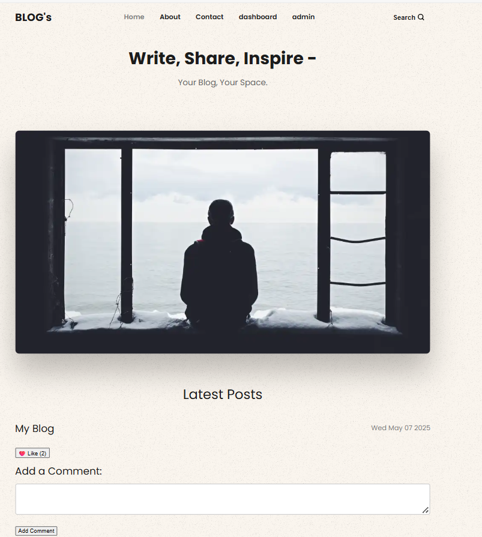

# 🅱log Website

# Description

A dynamic blog website built with Node.js, Express, and EJS templates.

# Features
✅ Create, read, update, and delete blog posts

✅ Dynamic views using EJS

✅ Clean and responsive design

✅ MongoDB for storing blog data


## Run Locally

Clone the project

```bash
git clone https://github.com/your-username/blog-website.git

```

Go to the project directory

```bash
cd blog-website

```

Install dependencies

```bash
npm install
```

Configure environment variables:

```bash
PORT=3000
MONGO_URI=your_mongodb_connection_string

```
Run the app:
```bash
npm start

```


## Tech Stack

**Backend**: Node.js, Express.js

**Frontend**: EJS, HTML, CSS

**Database**: MongoDB


